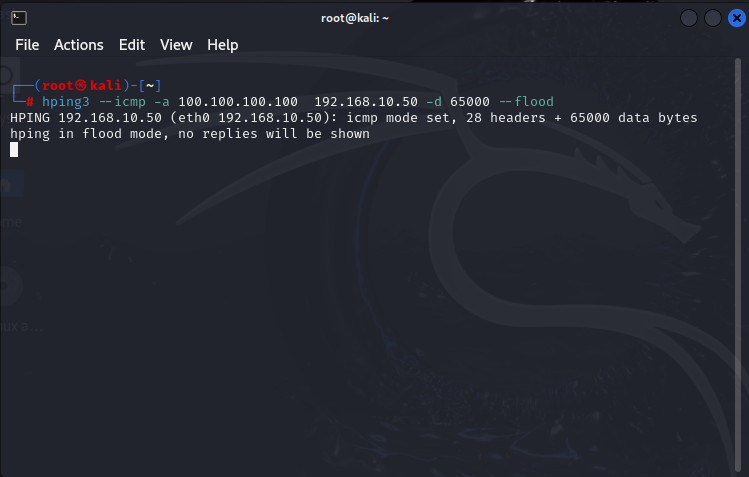
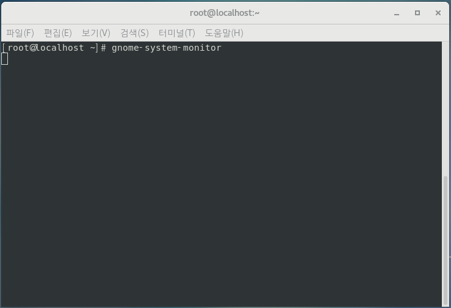
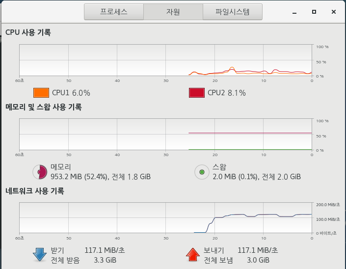
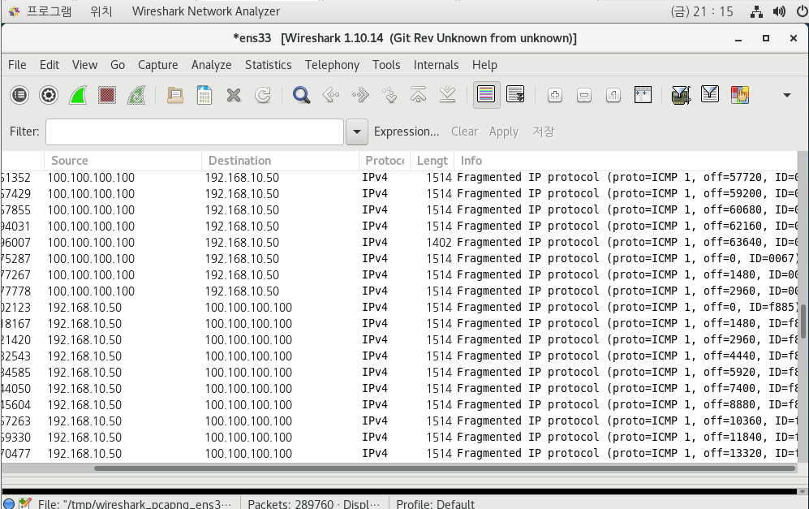
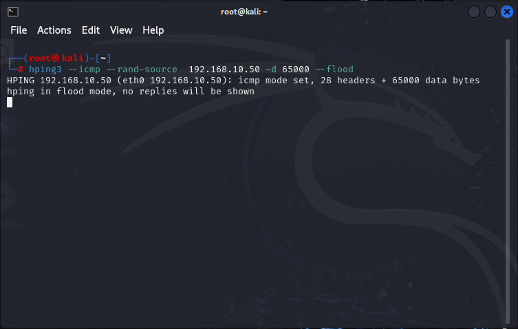
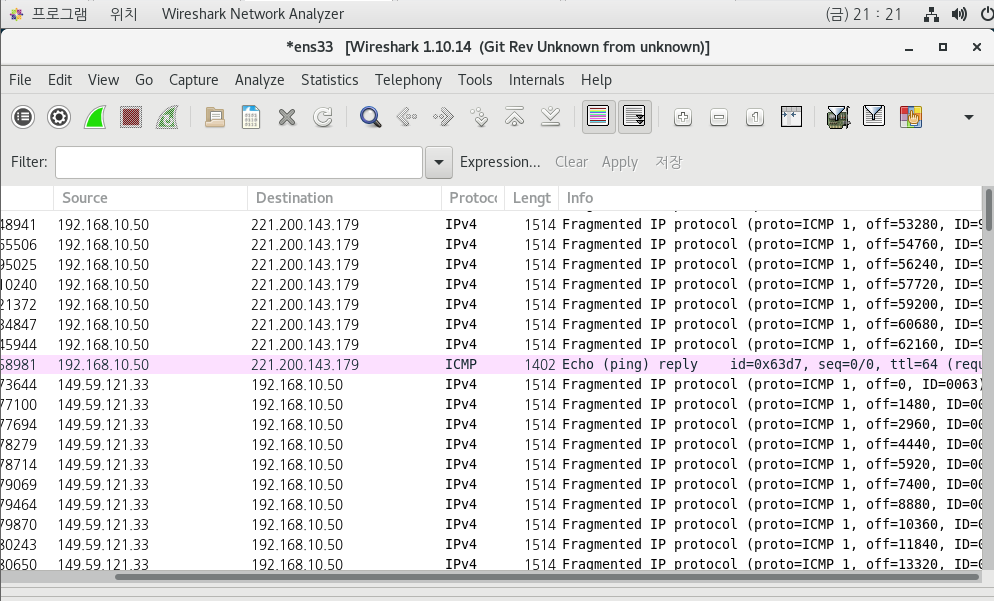

# Ping of Death
***

SYN flooding에 이어 DoS 공격 유형 중 하나인 Ping of Death를 살펴보겠습니다.

<br/>
<br/>
<br/>

Ping of Death는 규정 크기를 넘는 ICMP 패킷을 이용해 시스템을 마비시키는 공격입니다. 여기서 보통 규정 크기(Maximum Transmission Unit, MTU)는 1500 byte입니다.

규정 크기 이상의 패킷을 보내면 어떻게 되길래 시스템이 마비되는 걸까요? 설명을 위해 크기가 60000 byte인 패킷을 보냈다고 가정해 보겠습니다. 60000 byte는 규정 크기인 1500 byte보다 큽니다. 하지만 패킷이 규정 크기 이하여야 한번에 전송할 수 있어요. 그래서 패킷을 분할해서 단편화(Fragmentation)해 보냅니다. 그리고 수신측에서 단편화된 패킷을 조립해 원래의 패킷으로 복구해요. 그렇게다면 이렇게 큰 패킷을 계속해서 보내게 되면 어떻게 될까요? 정상적인 패킷을 처리할 때보다 많은 부담이 가해지게 되고, 결론적으로는 시스템을 공격할 수 있습니다.

<br/>
<br/>
<br/>

## 실습
Kali Linux: 192.168.10.250
CentOS 7: 192.168.10.50
***
Kali Linux를 이용해 CentOS 7에 Ping of Death 공격을 해보겠습니다. 

<br/>
<br/>
<br/>


터미널에서 아래처럼 입력해 공격할 수 있습니다.
```shell
hping3 --icmp -a 100.100.100.100 192.168.10.50 -d 65000 --flood
```
--icmp와 -d 옵션을 이용해서 규정 크기 이상으로 설정한 ICMP패킷을 전송합니다. 공격을 확인하기 쉽도록 IP는 100.100.100.100으로 변조하였습니다.

<br/>
<br/>
<br/>


공격 전 CentOS 7에서 미리 모니터를 실행해주면

<br/>
<br/>
<br/>


공격을 받았을 때 네트워크 사용량이 급격하게 상승하는 것을 확인할 수 있습니다.

<br/>
<br/>
<br/>


wireshark도 살펴볼까요?
IP가 100.100.100.100으로 변조된 것을 확인할 수 있습니다. 
또한 Info의 Fragmented IP protocol, proto=ICMP를 통해 분할된 ICMP 패킷을 받은 사실을 볼 수 있습니다. 

<br/>
<br/>
<br/>


SYN Flooding때와 마찬가지로 --rand-source 옵션도 사용할 수 있습니다.
```shell
hping3 --icmp --rand-source 192.168.10.50 -d 65000 --flood
```

<br/>
<br/>
<br/>


공격 후 wireshark에서 랜덤하게 변조된 IP를 확인해 보겠습니다.
한 IP에서 패킷을 하나 보냈어도, 여러 개로 분할되어 전송되기 때문에 위와 같이 캡처된 것을 볼 수 있습니다.